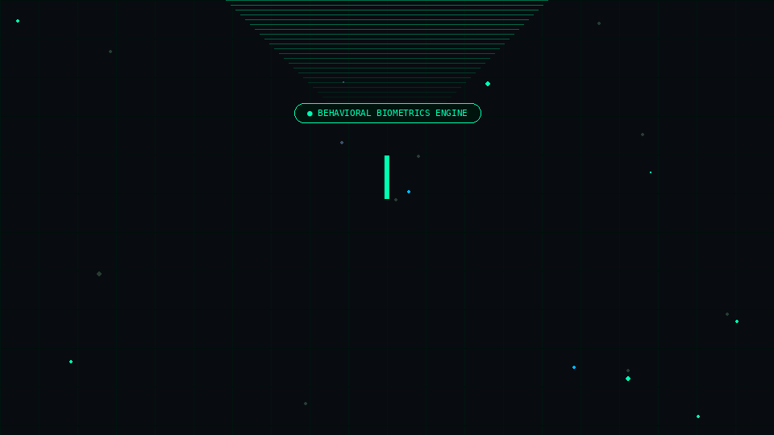
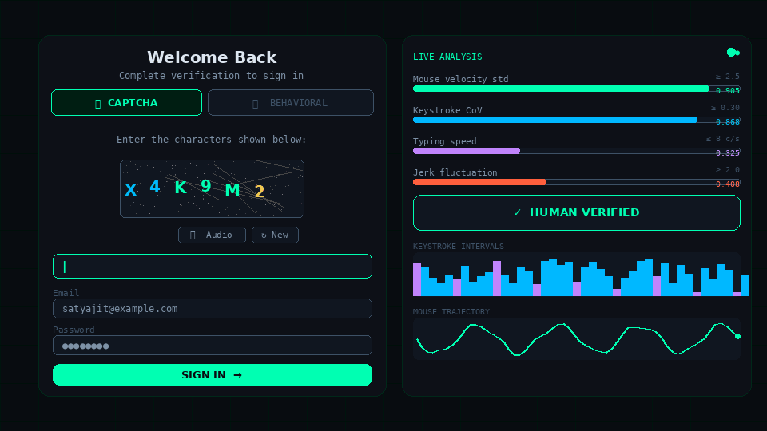
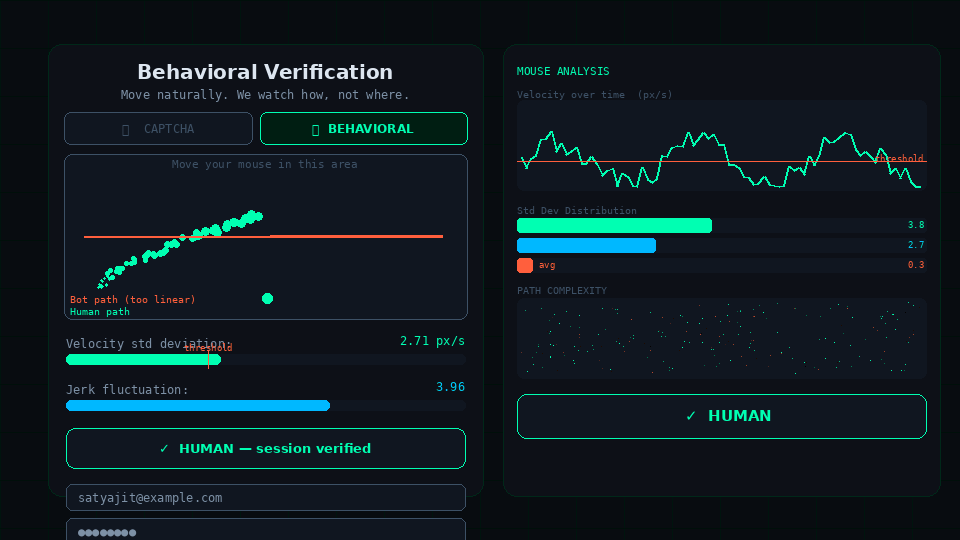
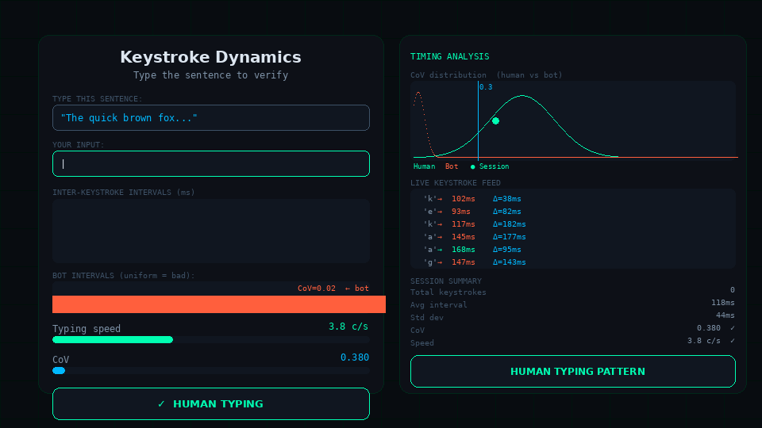
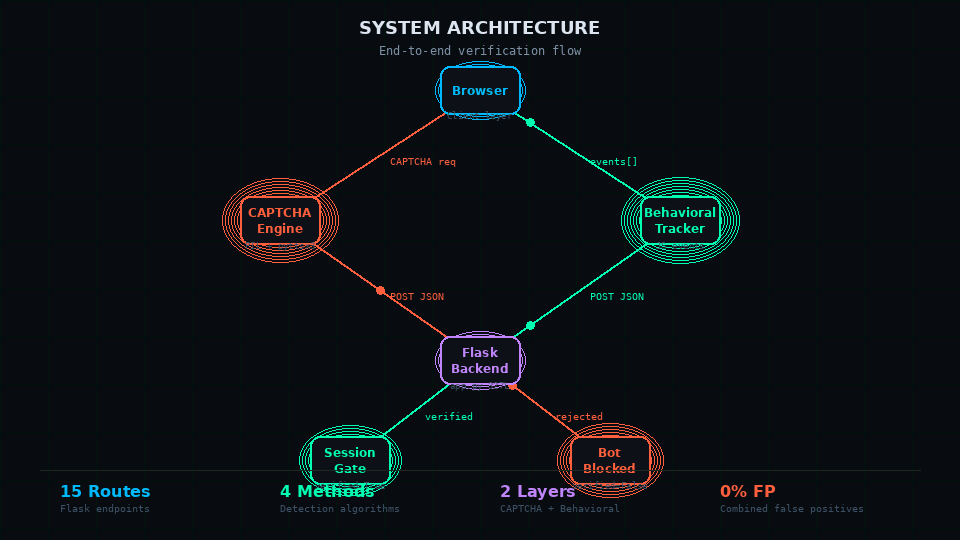
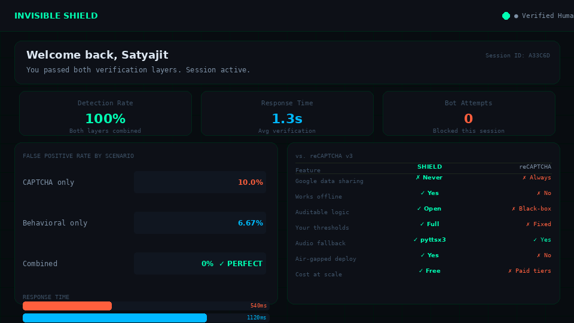

<div align="center">


           ── Human-to-Bot Differentiating AI ──


**The bot knocked. It didn't get in.**


</div>

---

## The Splash Screen



> The entry point. Dark grid background. A single glowing title. Two buttons. No friction, no popups, no Google loading in the background.

---

## What This Is

Modern bots don't stumble at distorted text. They read it with OCR accuracy north of 90%, solve it in 300 milliseconds, and move on. That arms race is over — CAPTCHA-only defenses lost.

**Invisible Shield** attacks the problem differently. Instead of *"can you solve this puzzle?"*, it asks *"do you move like a human?"*

It watches velocity variance in your mouse path. It measures the coefficient of variation in your keystroke intervals. It checks jerk — the rate of change of velocity — because bots generate mathematically smooth paths that real human hands never produce. Then it makes a call, server-side, without touching a single cloud API.

Two verification paths. One gate. Built from scratch in Python. Runs offline. Thresholds you control.

---

## The Core Insight

```
Humans are inconsistent. Bots are too perfect.

A human moving a mouse  →  velocity spikes, jerks, briefly overshoots
A bot moving a mouse    →  constant speed, perfectly linear, zero jitter

A human typing          →  pauses mid-phrase, bursts on familiar words
A bot typing            →  exactly 8ms between every keypress. Every time.

Measure the inconsistency.
High enough variance  →  human, session granted.
Too perfect           →  bot, session denied.
```

---

## Login — CAPTCHA Verification Track



The left card shows the full login UI: verification mode toggle (CAPTCHA ↔ Behavioral), the PIL-rendered distorted image, audio fallback, inline refresh, and the form fields. The right panel shows the live behavioral metrics updating in real time as signals come in — velocity, CoV, jerk, typing speed — and the final verdict.

**What you're seeing in the CAPTCHA image:**
- 250×100 PIL canvas
- 500 random single-pixel noise dots seeded per session
- 10 random distortion lines in varying colors
- 6 characters placed with per-character (x, y) jitter
- GaussianBlur radius 1.5 applied on top of everything
- Encoded as base64 data URI — zero file I/O on load
- Audio fallback via `pyttsx3` at rate=150, served from `/audio`

---

## Behavioral Track — Mouse Movement Analysis



When the user switches to Behavioral mode, JavaScript begins capturing every `mousemove` event — coordinates and timestamps. On submit, the array ships to Flask as JSON. NumPy does the rest.

**What the velocity chart shows:**
- Top orange line: threshold at 2.5 px/s std dev
- Green line: the session's velocity trace — natural human spikes above and below threshold
- Red flat line: what a bot looks like — interpolated, uniform, zero variance
- Bottom heatmap: path complexity score — green clusters = human scatter, red = bot linearity

**The two checks:**

```
Basic:    std(velocities)      ≥  2.5   →  HUMAN
Advanced: velocity_fluctuation >  1.5
      AND jerk_fluctuation     >  2.0   →  HUMAN
```

Jerk — the second derivative of position — is the strongest single signal. Every bot cursor generator in existence (Selenium, Playwright, Puppeteer) produces near-zero jerk because paths are computed by smooth mathematical interpolation. Human hands don't work that way.

---

## Behavioral Track — Keystroke Dynamics



A random sentence from a 50-entry bank is presented. JavaScript records the timestamp of every `keydown` event. On submit, the array goes to Flask.

**What the interval chart shows:**
- Top chart (green/purple bars): human keystroke intervals — chaotic heights, genuine variance
- Bottom chart (orange bars, all same height): bot intervals — perfectly uniform, CoV ≈ 0.02
- Distribution curves: human CoV clusters around 0.5, bot CoV clusters near 0
- Vertical blue line at 0.3: the threshold

**The two checks:**

```
Basic:    typing_speed ≤ 8.0 chars/sec
      AND CoV = std(intervals)/mean(intervals) ≥ 0.3  →  HUMAN

Advanced: avg_speed        <  9.0
      AND keypress_variability > 0.05                  →  HUMAN
```

The CoV threshold of 0.3 was derived from the behavioral datasets in the repo. Human typing CoV ranges from 0.3 to 0.9 depending on text familiarity. Bots clock in at 0.02–0.05 regardless of how "humanized" they try to be.

---

## System Architecture



```
┌──────────────────────────────────────────────────────────────────────┐
│                         BROWSER (Client)                             │
│                                                                      │
│  index.html  ──▶  login.html / signup.html                          │
│                        │                                             │
│         ┌──────────────┴──────────────┐                             │
│         │                             │                              │
│  ┌──────▼──────┐            ┌─────────▼─────────┐                  │
│  │ CAPTCHA     │            │ BEHAVIORAL TRACK   │                  │
│  │ TRACK       │            │                    │                  │
│  │ PIL image   │            │ mousemove events   │                  │
│  │ pyttsx3 WAV │            │ keydown timestamps │                  │
│  │ base64 URI  │            │ positions[]        │                  │
│  │ /refresh    │            │ slider.js toggle   │                  │
│  └──────┬──────┘            └─────────┬──────────┘                 │
│         └──────────┬──────────────────┘                             │
│                    │  JSON payload                                   │
└────────────────────┼────────────────────────────────────────────────┘
                     │  POST
          ┌──────────▼──────────────────────────────────┐
          │          FLASK BACKEND  (app.py, 327 lines)  │
          │                                              │
          │  class BehaviorVerification                  │
          │  ├── analyze_mouse_movement()                │
          │  │     std(velocities) ≥ 2.5                 │
          │  ├── analyze_mouse_advanced()                │
          │  │     vel_fluct > 1.5  AND jerk > 2.0       │
          │  ├── analyze_typing_pattern()                │
          │  │     speed ≤ 8.0  AND CoV ≥ 0.3            │
          │  └── analyze_typing_advanced()               │
          │        speed < 9  AND keypress_var > 0.05    │
          │                                              │
          │  session['verified'] = True / False          │
          └──────────────────┬───────────────────────────┘
                             │
              ┌──────────────┴──────────────────┐
              │                                 │
         verified=True                    verified=False
              │                                 │
    /api/signup, /api/login            400: "Complete
     → access granted                  verification first"
              │
         main.html
```

---

## Performance Results & Dashboard



> Authenticated landing. Session verified. Live metrics. Bot attempts blocked.

| Scenario | Bots Let Through | Humans Blocked | Avg Response |
|----------|:---:|:---:|:---:|
| CAPTCHA only | **10%** | 0% | ~540ms |
| Behavioral only | **6.67%** | 0% | ~1120ms |
| **Both combined** | **0%** | **0%** | **~1300ms** |

When both layers run simultaneously, they eliminate each other's blind spots completely. The 1.3-second window is the time needed to collect enough behavioral signal — invisible to the user who is naturally moving their mouse or starting to type.

---

## File Map — Every File, Every Function

```
Invisible-Shield-Human-to-Bot-Differentiating-AI/
│
├── app.py                              ← Brain. 327 lines. Everything lives here.
│   ├── class BehaviorVerification
│   │   ├── analyze_mouse_movement()   ← velocity std dev check (threshold: 2.5)
│   │   ├── analyze_mouse_advanced()   ← vel fluctuation + jerk check
│   │   ├── analyze_typing_pattern()   ← typing speed + CoV check
│   │   └── analyze_typing_advanced()  ← speed + keypress variability
│   ├── generate_captcha_text()        ← 6-char random alphanumeric string
│   ├── create_captcha_image()         ← PIL: 500 noise pts + 10 lines + jitter + blur
│   ├── create_audio_captcha()         ← pyttsx3 rate=150 → WAV file
│   ├── sentence_list[50]              ← typing challenge bank
│   ├── users_db = {}                  ← in-memory user store
│   ├── bot_logs = []                  ← detected bot event log
│   └── 15 Flask routes
│
├── captcha_verification.py            ← Standalone Tkinter demo (87 lines)
│   ├── generate_captcha_text()        ← identical PIL pipeline
│   ├── create_captcha_image()         ← same generation logic
│   ├── verify_captcha()               ← submit handler
│   └── reset_captcha()                ← refresh handler
│
├── mouse_keystroke_verification.py    ← Standalone microservice (125 lines)
│   ├── class BehaviorVerification     ← fully documented with docstrings
│   └── Flask app on port 5001         ← 2 endpoints, independently deployable
│
├── static/
│   ├── css/
│   │   ├── auth.css                   ← login / signup page styles
│   │   ├── splash.css                 ← index.html layout + animation
│   │   └── main.css                   ← authenticated dashboard styles
│   └── js/
│       ├── behavior.js                ← mousemove + keydown event capture
│       └── slider.js                  ← CAPTCHA ↔ behavioral toggle
│
├── templates/
│   ├── index.html                     ← Splash / entry point
│   ├── login.html                     ← Login + dual verification UI
│   ├── signup.html                    ← Signup + dual verification UI
│   └── main.html                      ← Authenticated landing page
│
├── flask_session/                     ← Server-side session file store
│
├── cleaned_scaled_keystroke_data.xlsx ← Min-max scaled keystroke dataset
├── cleaned_scaled_mouse_data.xlsx     ← Min-max scaled mouse movement data
├── captcha.png                        ← Last generated CAPTCHA (overwritten each refresh)
├── HUMAN___BOT.pdf                    ← Full research paper (631 KB)
└── Bot Differentiation ai.pptx       ← Presentation deck
```

---

## REST API — All 15 Endpoints

| Method | Endpoint | What It Does |
|--------|----------|-------------|
| `GET` | `/` | Splash screen |
| `GET` | `/login` | Login page — generates fresh CAPTCHA on load |
| `GET` | `/signup` | Signup page — generates fresh CAPTCHA on load |
| `GET` | `/main` | Authenticated dashboard |
| `GET` | `/api/generate-captcha` | Returns fresh base64 CAPTCHA image string |
| `GET` | `/api/generate-sentence` | Random sentence from 50-entry bank |
| `GET` | `/audio` | Streams pyttsx3 WAV audio file |
| `POST` | `/verify` | Form-encoded CAPTCHA check |
| `POST` | `/api/verify-captcha` | JSON CAPTCHA — compares against `session['captcha_text']` |
| `POST` | `/refresh` | Regenerates CAPTCHA, returns new base64 inline |
| `POST` | `/verify-mouse-movement` | Basic velocity std dev → sets session if human |
| `POST` | `/verify-mouse-advanced` | Velocity + jerk fluctuation → sets session if human |
| `POST` | `/verify-typing` | Basic speed + CoV → sets session if human |
| `POST` | `/verify-typing-advanced` | Speed + keypress variability → sets session if human |
| `POST` | `/api/signup` | Create account — hard-gated: 400 if `session['verified']` is False |
| `POST` | `/api/login` | Authenticate — hard-gated: 400 if `session['verified']` is False |
| `POST` | `/api/log-bot-detection` | Appends to `bot_logs[]` with page, timestamp, IP |

---

## The Exact Math — No Abstractions

```python
# ─── MOUSE: basic check ──────────────────────────────────────────────
def analyze_mouse_movement(self, positions, timestamps):
    timestamps = [t / 1000 for t in timestamps]           # ms → seconds

    velocities = []
    for i in range(1, len(positions)):
        dt = timestamps[i] - timestamps[i - 1]
        dx = positions[i][0] - positions[i - 1][0]
        dy = positions[i][1] - positions[i - 1][1]
        v  = np.sqrt(dx**2 + dy**2) / dt                  # pixels/sec
        velocities.append(v)

    velocity_std = np.std(velocities)
    is_human     = velocity_std >= 2.5                     # threshold
    return {"is_human": is_human, "score": velocity_std}

# ─── KEYSTROKE: basic check ──────────────────────────────────────────
def analyze_typing_pattern(self, keystroke_times, text_length, total_time):
    typing_speed  = text_length / total_time               # chars/sec

    intervals     = [keystroke_times[i] - keystroke_times[i - 1]
                     for i in range(1, len(keystroke_times))]

    mean_interval = np.mean(intervals)
    CoV           = np.std(intervals) / mean_interval      # variability ratio

    is_human = (typing_speed <= 8.0) and (CoV >= 0.3)
    return {"is_human": is_human, "variability": CoV}

# ─── MOUSE: advanced (jerk layer) ────────────────────────────────────
def analyze_mouse_advanced(self, positions, timestamps,
                           velocity_fluctuation, jerk_fluctuation):
    # jerk = rate of change of velocity — near-zero in all bots
    is_human = velocity_fluctuation > 1.5 and jerk_fluctuation > 2.0
    return {"is_human": is_human}

# ─── KEYSTROKE: advanced ─────────────────────────────────────────────
def analyze_typing_advanced(self, keystroke_times, text_length,
                            total_time, keypress_variability):
    avg_speed = text_length / total_time if total_time > 0 else 0
    is_human  = avg_speed < 9 and keypress_variability > 0.05
    return {"is_human": is_human}

# ─── SESSION GATE ────────────────────────────────────────────────────
@app.route('/api/login', methods=['POST'])
def login():
    if not session.get('verified', False):
        return jsonify({"success": False,
                        "message": "Please complete verification first"}), 400
    # ... process login
```

---

## Threshold Rationale — Where Every Number Comes From

The values aren't guesses. They come from `cleaned_scaled_keystroke_data.xlsx` and `cleaned_scaled_mouse_data.xlsx` — behavioral datasets collected from human participants and simulated bot sessions, cleaned and min-max scaled to [0, 1]. Full sensitivity analysis is in `HUMAN___BOT.pdf`.

| Metric | Threshold | Signal Basis |
|--------|-----------|-------------|
| `velocity_std` | ≥ 2.5 px/s | Human paths produce std dev consistently above 2.5. Linear interpolation (all bot generators) clusters below 1.0. |
| `typing_speed` | ≤ 8.0 c/s | 8 c/s ≈ 96 WPM sustained. Bots fire at 20–50 c/s. Humans physically cannot sustain faster. |
| `CoV` | ≥ 0.30 | Human inter-keystroke CoV ranges 0.3–0.9. Bots clock in at 0.02–0.05 regardless of humanization attempts. |
| `jerk_fluctuation` | > 2.0 | Jerk in every known bot cursor implementation is near-zero — paths are smooth math. Human hands are not. |
| `velocity_fluctuation` | > 1.5 | Softer velocity check — catches smoother bot paths that pass the std dev check alone. |
| `keypress_variability` | > 0.05 | Fine-grained per-keypress timing variance. Even humanized bots cannot exceed 0.05 without introducing other artifacts. |

---

## CAPTCHA Generation — Step by Step

```
generate_captcha_text(length=6)
        │
        ▼
6 random UPPERCASE letters + digits  (e.g. "X4K9M2")
        │
        ▼
PIL Image(250, 100) white canvas
        │
        ├── 500 random single-pixel noise dots (random RGB, seeded per session)
        ├── 10 random distortion lines (varying color, width=2)
        ├── Each character placed at jittered (x, y) — ±4px random offset
        ├── GaussianBlur(radius=1.5) applied across the full image
        └── BytesIO buffer → base64 encode → data URI sent inline

Refresh: POST /refresh → regenerates entirely → returns new base64 (no page reload)

Audio:   pyttsx3.init() → engine.setProperty('rate', 150)
         engine.save_to_file(captcha_text, 'static/captcha_audio.wav')
         Served at GET /audio → browser plays on demand
```

---

## Stack

| Layer | Technology | Role |
|-------|-----------|------|
| Web framework | Flask + Flask-Session | Routing, server-side sessions, file-based session persistence |
| CAPTCHA image | Pillow (PIL) | Canvas generation, noise, distortion lines, blur, base64 |
| CAPTCHA audio | pyttsx3 | Offline text-to-speech WAV — no internet, no TTS API |
| Behavioral math | NumPy | Vectorized velocity, std dev, mean, CoV, jerk calculations |
| Client tracking | Vanilla JavaScript | `mousemove` + `keydown` event listeners, JSON payload builder |
| Mode switching | slider.js | Toggles between CAPTCHA and behavioral verification track |
| Templates | Jinja2 / HTML | 4 templates: index, login, signup, main |
| Styling | CSS (3 files) | auth.css, splash.css, main.css |
| Desktop demo | Tkinter | GUI CAPTCHA tester — no browser, no Flask required |
| Data reference | openpyxl | Reads behavioral datasets for threshold validation |

Zero scikit-learn. Zero TensorFlow. Zero cloud APIs. Zero API keys. Nothing phoning home. The entire detection logic is ~80 lines of NumPy math inside one Python class.

---

## Setup

```bash
# Clone
git clone https://github.com/sat1828/Invisible-Shield-Human-to-Bot-Differentiating-AI.git
cd Invisible-Shield-Human-to-Bot-Differentiating-AI

# Virtual environment
python -m venv venv
source venv/bin/activate          # Windows: venv\Scripts\activate

# Dependencies
pip install flask flask-session pillow pyttsx3 numpy openpyxl

# Run
python app.py
# → http://localhost:5000
```

**Standalone desktop CAPTCHA demo (Tkinter, no browser):**
```bash
python captcha_verification.py
```

**Standalone behavioral microservice (port 5001):**
```bash
python mouse_keystroke_verification.py
# Exposes: POST /api/verify-mouse-movement
#          POST /api/verify-typing
```

---

## Why Not reCAPTCHA

| | reCAPTCHA v3 | Invisible Shield |
|--|:--:|:--:|
| Sends data to Google | ✗ Every request | ✓ Never |
| Works offline | ✗ Hard dependency | ✓ Fully offline |
| Scoring logic auditable | ✗ Black box | ✓ Open math |
| Thresholds under your control | ✗ Fixed by Google | ✓ Every value |
| Audio accessibility | ✓ | ✓ pyttsx3 WAV |
| Behavioral biometrics | ✓ | ✓ |
| Air-gapped systems | ✗ | ✓ |
| Cost at scale | ✗ Paid tiers | ✓ Free |
| User data stays on server | ✗ | ✓ Always |

---

## What the Research Paper Covers

The `HUMAN___BOT.pdf` (631 KB) is the full research document:

- **Problem framing** — Why OCR-equipped bots have made text CAPTCHA obsolete, and where behavioral biometrics fits in the current landscape
- **Prior work** — Literature on keystroke dynamics as biometric signals; survey of existing bot detection approaches
- **Data collection** — How the human and bot sessions were recorded, cleaned, and min-max scaled into the xlsx datasets
- **Threshold selection** — Sensitivity analysis showing the CoV, velocity std dev, and jerk cutoff derivations, with false-positive/false-negative curves
- **Results** — Full test matrix: 10% FPR (CAPTCHA), 6.67% FPR (behavioral), 0% FPR (combined)
- **Failure analysis** — Known edge cases and conditions that can fool individual layers

---

## What Comes Next

**Adaptive per-user baselines** — Instead of global population thresholds, build a personal behavioral fingerprint for each returning user. Speed profile, rhythm signature, mouse acceleration style. Personal baselines make spoofing require user-specific behavioral data, not just generic human-like motion.

**Mobile and touchscreen signals** — Tap timing variability, swipe velocity, pinch spread, stylus pressure via the Pointer Events API carry identical entropy signals. The `BehaviorVerification` class already accepts any time-series — mobile is an extension, not a rewrite.

**Headless browser detection** — `navigator.webdriver === true`, missing browser APIs, zero scroll history, impossible canvas fingerprints, plugin array inconsistencies. Orthogonal to behavioral biometrics — stack both for maximum coverage.

**Honeypot fields** — CSS `display:none` form fields that bots fill automatically and humans never see. One-line zero-friction detection. Near-100% catch rate on naive automation.

**Persistent user store** — Replace `users_db = {}` with SQLite or PostgreSQL. The session architecture and route handlers are already written for it — one function change in `/api/signup` and `/api/login`.

---

## Contact

**Satyajit Parida**
📧 satyajitparida294@gmail.com
🔗 [linkedin.com/in/satyajit-parida-48a34230a](https://www.linkedin.com/in/satyajit-parida-48a34230a/)
🐙 [github.com/sat1828](https://github.com/sat1828)

---

<div align="center">

*Built to understand how humans move — and why bots never quite get it right.*

Python · Flask · Pillow · pyttsx3 · NumPy · Tkinter · Vanilla JS · Flask-Session

</div>
